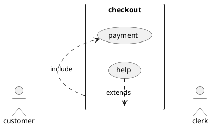
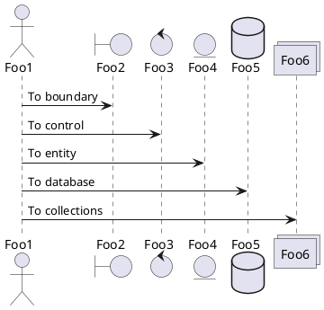
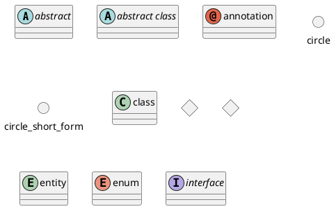
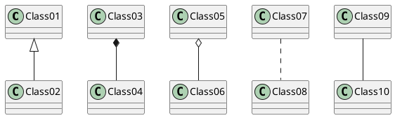

# UML (Unified Modeling Language)

### Use case Diagram
<div hidden>

</div>


### Sequence Diagram


## Class Diagram
```
@startuml
abstract        abstract
abstract class  "abstract class"
annotation      annotation
circle          circle
()              circle_short_form
class           class
diamond         diamond
<>              diamond_short_form
entity          entity
enum            enum
interface       interface
@enduml
```


```
@startuml
Class01 <|-- Class02
Class03 *-- Class04
Class05 o-- Class06
Class07 .. Class08
Class09 -- Class10
@enduml
```
